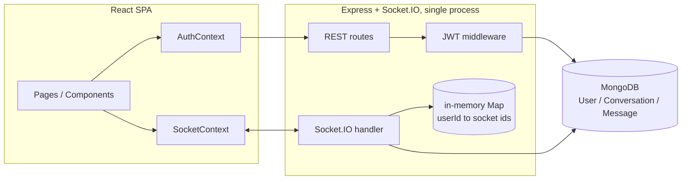

# Wire — Engineering Review & Roadmap

Source of truth: the existing codebase (`server/` = Node/Express/Socket.IO/Mongoose,
`client/` = React/Vite/Bootstrap). This review is based on reading every file, not a
generic checklist. Nothing here proposes a rewrite — everything is framed as an
incremental change to what's already working.

## 1. Current architecture

One JWT, issued by `/api/auth`, authenticates **both** the REST API (via an
`Authorization: Bearer` header) and the Socket.IO connection (via
`socket.handshake.auth.token`, checked in an `io.use()` middleware). That's a
clean, correct design decision worth calling out on its own.

## 2. Strengths (genuinely, not just to be nice)

- **Unified auth model** — one token, one verification path, reused for REST and
  sockets instead of inventing a second scheme.
- **Presence correctly handles multi-tab/device** — it's a `Map<userId, Set<socketId>>`,
  not a naive boolean, so opening the app in two tabs doesn't cause flapping
  online/offline state. A lot of tutorial-grade chat apps get this wrong.
- **Membership check exists** where it matters most (`message:send` verifies the
  sender is actually a participant before persisting/broadcasting).
- **Clean schema design** — `Conversation.isGroup` as a discriminator instead of
  two separate collections is a reasonable, defensible choice for this scale.
- **Frontend state boundaries are sensible** — `AuthContext` and `SocketContext`
  are separated instead of one mega-context.

## 3. Weaknesses & technical debt

- **The centralized Express error handler is dead code.** `index.js` defines
  `app.use((err, req, res, next) => ...)`, but every single route catches its
  own errors internally and calls `res.status(500).json(...)` directly — none
  of them call `next(err)`. The handler you wrote never runs.
- **No request-validation layer.** Validation is ad hoc per route, plus
  whatever Mongoose's schema validation happens to catch — which means some
  bad input gets a clean `400`, and other bad input (e.g. a too-short username)
  throws a Mongoose `ValidationError` that gets caught generically and returned
  as a `500 "Registration failed"`. That inconsistency is the actual bug, not
  just a style nit.
- **Duplicated, inconsistent authorization logic.** "Is this user a participant
  of this conversation?" is implemented correctly in `message:send` and in the
  REST message-history route — but is **missing** in the `conversation:join`
  and `message:read` socket handlers (see Security, below).
- **`isOnline` has two independent writers.** The REST login handler sets it to
  `true`; the socket connect/disconnect handlers are the ones that actually
  flip it back to `false`. If a client logs in over REST but the socket never
  connects (bad network, blocked WebSocket, whatever), `isOnline` gets stuck
  `true` forever. There should be exactly one source of truth.
- **No pagination anywhere** — not on conversations, not on message history.
  Fine today, won't be fine on a chat with thousands of messages.

## 4. Scalability issues

- **Presence lives in a process-local `Map`.** The moment this runs on more
  than one instance, it silently breaks: instance A has no idea who's
  connected to instance B. Same problem applies to Socket.IO room broadcasts
  in general without a shared adapter. Fix is well-known: `@socket.io/redis-adapter`
  + move presence state into Redis.
- **`io.emit("presence:update", ...)` broadcasts to literally every connected
  socket**, not just people who share a conversation with that user. Fine at
  demo scale, an O(n) cost that doesn't belong in a "scales" story.
- **Unbounded message history fetch** — `GET /api/messages/:conversationId`
  loads the entire conversation in one query. Needs cursor-based pagination.
- **Read-receipt writes are unbounded** — `message:read` runs `updateMany`
  across the conversation's *entire* message history every time a chat is
  opened, instead of only touching the unread tail. There's no "last read
  message" pointer to bound this.

## 5. Security issues (ranked)

| Severity | Issue |
|---|---|
| **High** | `conversation:join` and `message:read` don't verify the connecting socket's user is actually a participant of that conversation. A user who knows/guesses a conversation ID can join its room (receiving all future live messages) or mark its messages as read, despite never being a member. `message:send` gets this right — the other two don't, and that inconsistency is the actual vulnerability. |
| **High** | No rate limiting anywhere — `/api/auth/login` and `/api/auth/register` are wide open to brute force / credential stuffing / registration spam. |
| **Medium** | JWTs live 7 days, sit in `localStorage` (readable by any injected script), with no refresh-token rotation and no server-side revocation. A leaked token is a valid credential for a week with no way to kill it. |
| **Medium** | No `helmet()` — missing standard security headers. |
| **Low–Medium** | Error responses leak raw internals (`error: err.message`) on 500s — minor reconnaissance value for an attacker. |
| **Low** | No email format validation, no verification step, no per-account login-attempt throttling. |

## 6. Performance bottlenecks

- Unbounded message-history and conversation-list queries (see above).
- Read-receipt bulk update touches more rows than necessary on every chat open.
- No caching layer — every read hits MongoDB directly. Not wrong at this
  scale, but worth naming explicitly as a deliberate "not yet needed" choice
  rather than an oversight, if asked in an interview.

---

## 7. Roadmap, ranked by your priorities

### Priority 1 — Architecture, error handling, validation, auth, socket reliability

| # | Change | Why | Interview value | Difficulty | Est. time | Impact |
|---|---|---|---|---|---|---|
| 1 | Make routes call `next(err)` + add an `asyncHandler` wrapper so the centralized error handler you already wrote actually runs | Removes the single biggest inconsistency in the codebase | High — "how do you handle errors across an Express app" is a near-guaranteed question | Low | 1–2 hrs | Med-High |
| 2 | Add request validation at the edge (Zod or express-validator) on every route | Kills the "500 instead of 400" bug class outright; schemas double as docs | High | Low-Med | 3–5 hrs | High |
| 3 | Fix the socket authorization gap: extract a shared `isParticipant(conversation, userId)` helper and use it in `conversation:join` and `message:read` too | This is a real, currently-exploitable bug — fixing it is both correct and a great story | Very high — security-mindedness is exactly what separates a resume from the pile | Low | 1–2 hrs | High |
| 4 | Make the socket layer the *only* writer of `isOnline`; REST login stops touching it | Removes a real race/desync | Medium — good "single source of truth" talking point | Low | 30 min | Medium |
| 5 | `express-rate-limit` on `/api/auth/*` | Cheapest fix for the biggest open security gap | High | Low | ~1 hr | High |
| 6 | Add `helmet()` | Standard, near-zero cost | Medium | Trivial | 15 min | Medium |

### Priority 2 — Professional features

| # | Change | Interview value | Difficulty | Est. time |
|---|---|---|---|---|
| 1 | Reply-to-message (`replyTo` ref on `Message`) | High | Medium | ~1 day |
| 2 | Message reactions | Good | Medium | ~1 day |
| 3 | File/image uploads (Cloudinary or S3-compatible) | High — expands scope meaningfully | Medium-High | 1–2 days |
| 4 | Message search (Mongo text index) | Good | Medium | ~1 day |
| 5 | Edit/soft-delete message | Decent | Low-Med | ~half day |

### Priority 3 — Production readiness

| # | Change | Interview value | Difficulty | Est. time |
|---|---|---|---|---|
| 1 | Structured logging (pino/winston) replacing `console.*` | Decent | Low | 2–3 hrs |
| 2 | Dockerize both apps + `docker-compose` for local dev (app + Mongo) | High — near table-stakes now | Medium | ~1 day |
| 3 | GitHub Actions CI (lint + build on PR) | High | Low-Med | ~half day |
| 4 | **Deploy to Render** | — this is the task we were already mid-way through | Low | 1–2 hrs |
| 5 | Basic monitoring (Render metrics or free-tier Sentry) | Medium | Low | ~1 hr |

### Priority 4 — Performance

| # | Change | Interview value | Difficulty | Est. time |
|---|---|---|---|---|
| 1 | Cursor-based message pagination + infinite scroll | **Very high** — the single most commonly asked "design a chat app at scale" question | Medium | ~1 day |
| 2 | Socket reconnection/backoff UI + offline queue | Good | Medium | ~1 day |
| 3 | Redis + Socket.IO adapter for presence | High — even at small scale, "designed to scale horizontally" is a strong claim to be able to back up | Medium-High | 1–2 days |
| 4 | Optimistic UI for sent messages | Good | Medium | ~1 day |

### Priority 5 — Resume polish

| # | Change | Difficulty | Est. time |
|---|---|---|---|
| 1 | README overhaul with the architecture diagram above | Low | ~2 hrs |
| 2 | API reference doc (endpoints, request/response shapes) | Low | 2–3 hrs |
| 3 | A living "interview talking points" doc turning each fix above into a STAR-format story | Low | 1–2 hrs |

---

## Recommendation on sequencing

Deploying to Render (Priority 3, item 4) is **independent** of all the code
quality work above and is cheap — I'd get it live now so you have a working
link today, then start Milestone 1 with Priority 1, items 1–3 (error handling
+ validation + the socket authorization fix), since those three are small,
correct the most important bug, and set up everything else cleanly.
