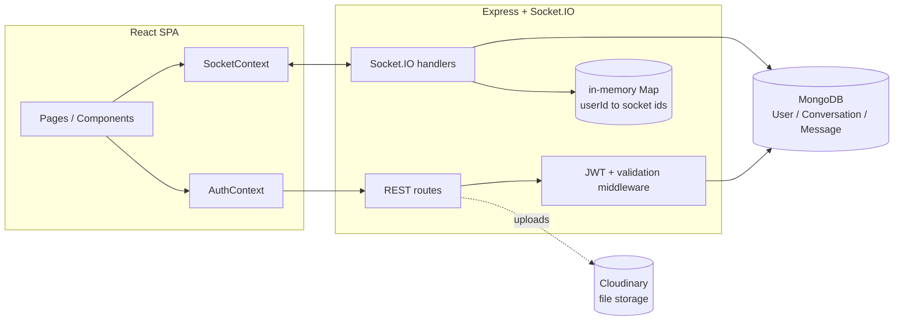

# Wire — Real-Time Chat Application

A production-grade real-time messaging platform built with a backend-first
mindset: private 1-on-1 chats, group rooms, live presence, typing
indicators, message reactions, replies, edits, full-text search, and file
attachments — all running on a hardened, tested, and CI-verified Node.js
backend, deployed and live.

**Live demo:** see deployment links in your own Render dashboard (frontend
and backend URLs depend on your deployment).

---

## Table of contents

- [Features](#features)
- [Tech stack](#tech-stack)
- [Screenshots](#screenshots)
- [Architecture overview](#architecture-overview)
- [Folder structure](#folder-structure)
- [Local setup](#local-setup)
- [Running with Docker](#running-with-docker)
- [Environment variables](#environment-variables)
- [Deployment](#deployment)
- [Security features](#security-features)
- [Performance optimizations](#performance-optimizations)
- [Testing](#testing)
- [CI/CD](#cicd)
- [Future improvements](#future-improvements)

---

## Features

**Messaging**
- Private 1-on-1 conversations and group rooms
- Real-time delivery over Socket.IO, with a JWT-authenticated handshake
- Reply-to-message with quoted context (including a placeholder if the
  original was later deleted)
- Message reactions (toggleable emoji reactions, grouped with counts)
- Edit and soft-delete your own messages
- Full-text search within a conversation
- Image/file attachments via Cloudinary
- Typing indicators (cleaned up automatically on disconnect)
- Read receipts ("Seen" on your last message in a DM)
- Online/offline presence, correctly handling multiple tabs/devices per user
- Cursor-based pagination with infinite scroll — messages, conversations,
  and search results all load incrementally, never all-at-once

**Platform**
- JWT authentication (register/login), rate-limited against brute force
- Centralized error handling — every REST and socket error funnels through
  one consistent, non-leaking response path
- Request validation at every route boundary (Zod)
- Structured JSON logging (pino), with per-request logging in production
- Graceful shutdown on `SIGTERM`/`SIGINT`
- A real health check endpoint that reflects actual database connectivity
- Dockerized, with a `docker-compose.yml` for running the whole stack
  locally
- CI (GitHub Actions) running the full test suite and a production build on
  every push/PR

---

## Tech stack

**Backend:** Node.js · Express · Socket.IO · MongoDB (Mongoose) · JWT ·
bcrypt · Zod · Cloudinary · pino · Vitest · Supertest

**Frontend:** React 18 · Vite · React Router v6 · Bootstrap 5 + Bootstrap
Icons · Axios · React Context API

**Infrastructure:** Docker · GitHub Actions · Render (backend Web Service +
frontend Static Site) · MongoDB Atlas

---

## Screenshots

> _Add screenshots here before sharing this README publicly — a login
> screen, the main chat view with an open conversation, and the reaction/
> reply UI in action are the three most useful to include._

```


```

---

## Architecture overview



One JWT authenticates both the REST API (`Authorization: Bearer` header) and
the Socket.IO connection (`socket.handshake.auth.token`), verified once via
an `io.use()` middleware at connect time.

**Key design decisions** (see [`INTERVIEW_GUIDE.md`](./INTERVIEW_GUIDE.md)
for the full reasoning behind each):
- MongoDB's document model maps naturally onto conversations/messages
  without the join overhead a relational schema would need for this
  access pattern.
- Socket.IO over raw WebSockets for its automatic reconnection, room
  abstraction (used directly for per-conversation broadcast scoping), and
  fallback transport handling.
- Cursor-based pagination (not offset) everywhere — see the "Performance
  optimizations" section below.

---

## Folder structure

```
realtime-chat-app/
├── server/
│   ├── src/
│   │   ├── config/          # db.js, logger.js, cloudinary.js
│   │   ├── models/          # User, Conversation, Message
│   │   ├── middleware/      # auth, validate, asyncHandler, rateLimiters
│   │   ├── routes/          # auth, users, conversations, messages, uploads
│   │   ├── sockets/         # socketHandler.js, isParticipant.js
│   │   ├── validators/      # Zod schemas, one file per route domain
│   │   └── index.js         # app bootstrap, health check, graceful shutdown
│   ├── tests/                # Vitest + Supertest
│   ├── Dockerfile
│   └── .env.example
└── client/
    ├── src/
    │   ├── api/              # Axios instance
    │   ├── context/          # AuthContext, SocketContext
    │   ├── pages/             # Login, Register, Chat
    │   ├── components/        # Sidebar, ChatWindow, MessageBubble, ...
    │   ├── utils/              # sound.js (Web Audio notification)
    │   └── index.css           # design system (CSS variables + animations)
    ├── Dockerfile
    ├── nginx.conf
    └── .env.example
```

---

## Local setup

### 1. Backend

```bash
cd server
npm install
cp .env.example .env
```

Fill in `server/.env` (see [Environment variables](#environment-variables)
below), then:

```bash
npm run dev      # nodemon, auto-restarts on changes
```

### 2. Frontend

```bash
cd client
npm install
cp .env.example .env
npm run dev
```

Open `http://localhost:5173`. Register two accounts (e.g. a normal window +
an incognito window) to test real-time messaging between them.

---

## Running with Docker

```bash
docker compose up --build
```

Spins up MongoDB, the backend, and the frontend (served via nginx) together
— client on `http://localhost:5173`, server on `http://localhost:5000`.
Uses the same production-style Dockerfiles as deployment, not a hot-reload
dev setup — for day-to-day development, `npm run dev` in each folder is
still faster.

---

## Environment variables

**`server/.env`**

| Variable | Required | Description |
|---|---|---|
| `PORT` | No (defaults to 5000) | Port the Express server listens on |
| `MONGO_URI` | **Yes** | MongoDB connection string |
| `JWT_SECRET` | **Yes** | Secret used to sign/verify JWTs — the app fails fast at boot if this is missing |
| `CLIENT_URL` | No (defaults to `http://localhost:5173`) | Used for CORS — must exactly match the frontend's real origin in production |
| `CLOUDINARY_CLOUD_NAME` | Only if using uploads | Cloudinary account cloud name |
| `CLOUDINARY_API_KEY` | Only if using uploads | Cloudinary API key |
| `CLOUDINARY_API_SECRET` | Only if using uploads | Cloudinary API secret |
| `NODE_ENV` | No | `production` switches logging to JSON output |
| `LOG_LEVEL` | No (defaults to `info`) | pino log level |

**`client/.env`**

| Variable | Required | Description |
|---|---|---|
| `VITE_API_URL` | **Yes** | The backend's URL — baked into the build at build time, not read at runtime |

---

## Deployment

Deployed as two independent services:
- **Backend** → Render Web Service (root directory `server`, build
  `npm install`, start `npm start`)
- **Frontend** → Render Static Site (root directory `client`, build
  `npm install && npm run build`, publish directory `dist`, with a SPA
  rewrite rule: `/*` → `/index.html`)
- **Database** → MongoDB Atlas, with Network Access set to allow all IPs
  (Render doesn't provide a static outbound IP on standard plans)

Two details that matter more than they look like they should:
- `VITE_API_URL` is baked into the frontend bundle **at build time** — changing
  it in Render's dashboard does nothing until you trigger a new build.
- `CLIENT_URL` on the backend must match the frontend's *actual* deployed
  URL exactly (protocol, no trailing slash) — CORS is locked to this exact
  origin, and it's the single most common cause of "works locally, breaks
  in production."

---

## Security features

- Passwords hashed with bcrypt, never stored or logged in plaintext
- JWT-based auth shared identically between REST and Socket.IO
- Every route validates input at the boundary (Zod) before touching the
  database — malformed input never reaches a query
- `express-rate-limit` on `/api/auth/register` and `/login` (10 requests /
  15 minutes per IP)
- `helmet()` for standard security headers
- Every socket handler that touches a conversation verifies the connecting
  user is actually a participant before acting — including `typing:*`
  events, which were the last handler class to get this check (see the
  interview guide for the story behind that)
- No internal error details (stack traces, database error text) ever reach
  the client — every error path (REST via the centralized handler, sockets
  via a matching helper) returns a generic message while logging the real
  one server-side
- 10MB upload size cap enforced server-side, independent of anything the
  client claims

---

## Performance optimizations

- **Cursor-based pagination** on message history, conversation list, and
  search results — nothing loads a full collection into memory. Compound
  indexes (`{conversation:1, _id:-1}` on messages, `{participants:1,
  updatedAt:-1, _id:-1}` on conversations) match the pagination queries'
  exact filter+sort shape.
- Infinite scroll on the frontend for all three, including scroll-position
  preservation when loading older messages (so scrolling up to load more
  doesn't yank your viewport back to the top).
- Presence tracked via a `Map<userId, Set<socketId>>` — correctly handles
  multiple tabs/devices per user without flickering online/offline state.
- Read-receipt state only updates changed rows (`$addToSet`), not the full
  message history on every read.

---

## Testing

```bash
cd server
npm test
```

52 tests: authorization logic (`isParticipant`), every Zod validation
schema including the new pagination cursors, the `validate`/`asyncHandler`
middleware, and the register/login routes (against a mocked database — no
real MongoDB needed to run the suite).

---

## CI/CD

`.github/workflows/ci.yml` runs on every push/PR to `main`: installs and
tests the backend, installs and builds the frontend, as two independent
jobs so a failure in one doesn't hide a failure in the other.

---

## Future improvements

Deliberately not done, and why:

- **Redis + Socket.IO adapter for presence** — only matters once running
  more than one server instance; a documented, reasonable deferral at
  current scale, not an oversight.
- **Optimistic UI for sent messages** — currently waits for the server
  round-trip before rendering your own message; a genuine UX polish item.
- **TypeScript** — would very likely be raised in review at a larger
  company, but migrating a codebase this size is a large, disruptive,
  multi-day change with real regression risk. Named here deliberately
  rather than silently ignored, not undertaken without a compelling
  specific reason.
- **Per-message read receipts in groups** — the backend already tracks
  `readBy` per message; only the group UI for it doesn't exist yet.
